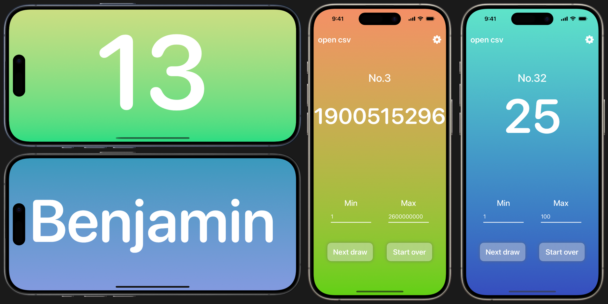

# Randomizer

## About
iPhone app with better random number picker (not on AppStore yet.) 
[Website](https://ulyssas.github.io/Rndsite/) 
My first ever Swift project

## Native Design
Randomizer is written in SwiftUI and has iOS native design.

## CSV Loading
Supports loading CSV name list. Winner's name will be shown below the number.

## Landscape mode
Only shows the number and hides controls. Works great when connected to a monitor.

## Future plans
Better code quality and maybe SessionManager(organizes multiple histories)
